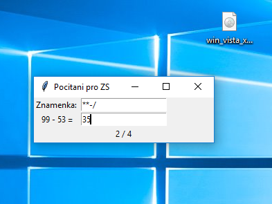

### Maturitní úloha: Počítání pro ZŠ

## Zadání
Navrhněte a vytvořte aplikaci pro testování žáků prvního stupně ZŠ. Aplikace
bude generovat příklady na sčítání, odčítání násobení a dělení (bezezbytku) do
sta.

Uživatel si volí, které matematické operace chce cvičit. Např. jen sčítání a
dělení. Uživateli je také vypsána statistika úspěšnosti.

## Konečný výsledek
* Po spuštění je program nastaven pouze na sčítání, pokud Vám však nestačí pouze sčítání, můžete si dopsat potřebné operace do prvního políčka, jak můžete vidět na ukázce GUI níže. Pokud zapíšete jedno znaménko víckrát, znamená to, že je větší šance, že ho dostanete v příkladu. Potom co si vypíšete všechny znaménka, je potřeba je povrdit ENTERem.
* Vaše výsledky můžete zapisovat do druhého políčka. Výsledek se potvrzuje pouze ENTERem.
* Pod druhým políčkem můžete nalést vaše aktuální skóre, počet správných odpovedí ku celkovému počtu.
* Pokud chcete restartovat statistiku, stačí zmáčknout ENTER v prvním políčku.
* Každé vstupní pole je blbovzdorné, tuduř, pokud do prvního políčka zapíšete např.: "-ahoj+" bude to vnímat pouze mínus a plus. Pokud však zde necháte prázdné pole a potvrdíte, bude automaticky do pole vloženo plus. Druhé pole však bere pouze čísla, pokud tam napíšete něco jiného, konsole vás mile ráda upozorní.

* https://mamut.spseol.cz/nozka/python/priklad_pocitaniZS/
* http://tkinter.programujte.com/
* http://infohost.nmt.edu/tcc/help/pubs/tkinter/web/index.html
